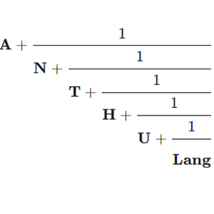

<div align="center">
  
</div>

# Anthu

> A fraction is a program.

**Anthu** is an esoteric programming language where the entire source code is a single rational number. The interpreter decodes it via the Euclidean algorithm and executes an instruction set grounded in Shannon's information theory.

Unlike traditional esoteric languages that operate on raw values, Anthu operates on **information** — each memory cell holds a (signal, noise) pair, and the language's behavior is governed by channel capacity.

Named after *Anthuphairesis* (ἀνθυφαίρεσις), the ancient Greek method of reciprocal subtraction — the mathematical ancestor of the Euclidean algorithm.

---

## Core Concept

Every rational number encodes a sequence of instructions. The Euclidean algorithm decomposes a fraction into quotients; each quotient modulo 10 maps to a command.

```
Fraction  →  Euclidean Algorithm  →  Quotients mod 10  →  Commands  →  Execution
```

Memory cells are not simple integers. Each cell is a **(signal, noise)** pair with a **channel capacity**:

```
C = log₂(1 + signal / noise)
```

Channel capacity determines:
- **Loop control** — loops continue while signal dominates noise (`s > n`)
- **Output fidelity** — noisy cells produce degraded output (`min(s, (s+n)//n)`)

---

## Command Reference

| mod 10 | Symbol | Name        | Effect                              |
|--------|--------|-------------|-------------------------------------|
| 0      | `+`    | amplify     | signal += 1                         |
| 1      | `-`    | attenuate   | signal -= 1                         |
| 2      | `!`    | inject      | noise += 1                          |
| 3      | `~`    | filter      | noise -= 1  (min 0)                 |
| 4      | `>`    | move right  | pointer →                           |
| 5      | `<`    | move left   | pointer ←                           |
| 6      | `[`    | loop start  | skip to `]` if signal ≤ noise       |
| 7      | `]`    | loop end    | jump to `[` if signal > noise       |
| 8      | `.`    | measure     | output value, limited by capacity   |
| 9      | `,`    | listen      | input → (signal=ASCII, noise=0)     |

---

## How Noise Works

In a noiseless cell `(s=72, n=0)`, measure outputs 72 (`'H'`) perfectly.

Add noise and the signal degrades:

| State      | Output              | Result |
|------------|---------------------|--------|
| (72, 0)    | min(72, ∞) = 72     | `'H'`  |
| (72, 1)    | min(72, 73) = 72    | `'H'`  |
| (72, 8)    | min(72, 10) = 10    | degraded |
| (72, 72)   | min(72, 2) = 2      | nearly destroyed |
| (72, 200)  | min(72, 1) = 1      | destroyed |

To produce correct output, you must **manage noise** — amplify signals and filter noise, just like real communication systems.

### Noise-Driven Loops

Loops exit when `signal ≤ noise` (channel capacity ≤ 1 bit). Instead of decrementing a counter to zero, you inject noise until the signal drowns:

```
+10 [ !2 ]    # Loop runs 5 times: noise rises 0→2→4→6→8→10, exits at s=n
```

After the loop, `filter` can restore the cell for reuse — analogous to error correction in real communication.

---

## Usage

### Run from fraction
```bash
python anthu.py run 355/113
python anthu.py run program.ant
```

### Run from assembly
```bash
python anthu.py asm examples/hello.asm
python anthu.py asm examples/hello.asm --debug
```

### Compile assembly to fraction
```bash
python anthu.py compile examples/hello.asm hello.ant
```

### Decode a fraction
```bash
python anthu.py decode 355/113
```

### Assembly syntax
```
+72 .          # Symbol syntax with repeat
amplify .      # Word syntax
amp*72 .       # Word with repeat
```

---

## Examples

### Hello, World!

`examples/hello.asm`:
```
+72 .           # H
> +101 .        # e
> +108 .        # l
> +108 .        # l
> +111 .        # o
> +44 .         # ,
> +32 .         # (space)
> +87 .         # W
> +111 .        # o
> +114 .        # r
> +108 .        # l
> +100 .        # d
> +33 .         # !
> +10 .         # newline
```

Compiled to a single fraction:

```bash
$ python anthu.py compile examples/hello.asm hello.ant
$ cat hello.ant
5351012560927625728623352550079531625515409096074915626468232563927219984741338290748205969688488993922463020400126412592980015191369111796936704370878617143331899653132435079091562772430929135716673455282468765097771266635837568517187898501017496597399664814621828354609226755903452649847127143987344877652493643742122841387422061833086030035778128320818400690103909680294267177836564054176978271698710981065265692523515026445477009547570145538220486771068221440611725432351516550377336327962192187379468469502127981611464371467272239726787547011626788230506657908346025196766929731773208603898200375050390776970500570112055598455260767726266039640522196384218008872916896269853412519379103199131640130227262807139743564977507288339764452241710933333056181956298419919392760260900564738779520221103226895397594923512533905545165614949813200844024137422206631567030777297993598926313249554658652588279041077356357359447572860139081547721429783893712339159298806947406296748498892341847897266753300944318748138832216237184763536991988500274595948216901807344220452078010426617977626833261822212825758887279110808874913523935058111830953514151982468330876518918649/458000760813999585886665419213390296507955054964062375053104255544506129934814212622588310208012446752329501494066723871118298659153740241844609439954199273648160854927218267421396927289597229979398774856179454756236190081125925404227322775102538483366018583194341440094199033393667922172789849150418421473061904308512087302602480775848880649277452473159929687976080070235446799723947153388053843266202886512494422215380031829182600031574232342225919238752397947579945368432882211323622359424902715743895134726415753094165813588140309284771491958898967439476265026512653052427612145795504808382045038958007216407192582935891361995858154895742192224866784005668535173429714016598992853416987932230587337911985036776132026015943832829083812663634157788675197743490019110096094677703547277972797171171708234197315217738564744295014393382770137251477274421639458297011201805435385307271837935965673637005113614258142270831471114397082193616584689173014553146629586046326241981927459433193563598751945790946413119133029687814266182492323551105948357436030076370951529968084473089978380243129633699073375165300293189857246263903639931184185821085401910330478843433358426
$ python anthu.py run hello.ant
Hello, World!
```

### Loop Counter

`examples/loop_demo.asm` — counts loop iterations using noise-based termination:

```
+10 [ !2 > + < ]    # 5 iterations (exits when noise=signal=10)
> +48 .              # Output: '5' (5 + 48 = ASCII '5')
> +10 .              # Newline
```

'''
117331473438099812559540083943694121144909932426998816001721874921500949681/1184932839809963522787607807180896910132630196916306340855087489720936494998
'''

---

## The Encoding

Anthu programs are continued fractions. The Euclidean algorithm on `p/q` produces quotients `[a₀; a₁, a₂, ...]`, where each `aᵢ mod 10` is a command.

Any rational number is a valid Anthu program. Whether it does something meaningful is another question.

```
355/113 = [3; 7, 6]  →  commands: filter, loop], [loop
```

The compiler reverses this: given a command sequence, it constructs quotients and builds the convergent fraction.

---

## Design Philosophy

Anthu asks: **what if programming were communication?**

In Shannon's model, transmitting information through a noisy channel requires managing signal-to-noise ratio. Anthu makes this the programming paradigm itself:

- Writing a program is encoding a message
- Executing is transmitting through a channel
- Noise accumulation is information decay
- Filtering is error correction
- Measurement is observation (with uncertainty)

You don't manipulate values — you manage information.

---

## Requirements

Python 3.7+ (standard library only).

---

## High-Level Compiler (anthuc)

Writing raw assembly is hard. `anthuc` provides a readable, information-theory-themed language that compiles down to Anthu assembly and fractions.

### Syntax

```python
channel msg              # Declare a named channel (memory cell)
signal msg = 72          # Set signal value
noise msg = 5            # Set noise value

amplify msg              # signal += 1
attenuate msg            # signal -= 1
inject msg * 3           # noise += 3
filter msg * 3           # noise -= 3

measure msg              # Output (limited by channel capacity)
listen msg               # Input (clean signal, no noise)

emit "Hello\n"           # Output string literal

copy src -> dst          # Copy signal between channels

while counter {          # Loop while signal > noise
    inject counter * 1
}
```

### Examples

**Hello, World!** — `examples/hello.anth`:
```
emit "Hello, World!\n"
```

**Noise Decay** — `examples/decay.anth`:
```
channel sig
signal sig = 72
measure sig              // 'H' — clean
inject sig * 8
measure sig              // degraded
filter sig * 8
measure sig              // 'H' — restored
```

**Loop Counter** — `examples/countdown.anth`:
```
channel counter
channel digit
signal counter = 5
while counter {
    inject counter * 1
    signal digit = 46
    measure digit
    attenuate digit * 46
}
emit "\ndone\n"
```
Output: `.....` followed by `done`.

### Usage

```bash
python anthuc.py run examples/hello.anth
python anthuc.py compile examples/hello.anth hello.asm    # → assembly
python anthuc.py compile examples/hello.anth hello.ant    # → fraction
python anthuc.py debug examples/hello.anth                # show generated assembly
```

---

## License

MIT

---

## Acknowledgments

Built with AI-assisted development (Claude, Anthropic).
Language concept and information-theoretic design by the author; implementation developed collaboratively with AI.
